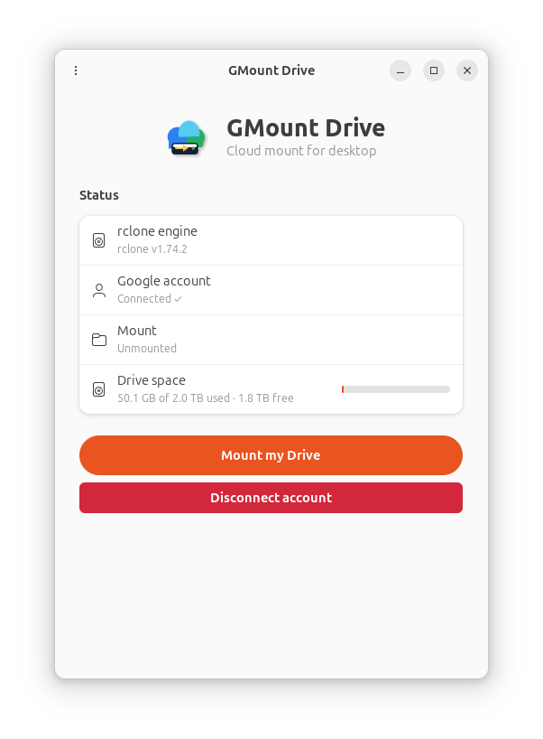

<div align="center">


# GMount Drive

**Mount your Google Drive as a disk on Linux — a free, open-source alternative to Insync.**

[](LICENSE)


</div>

---

GMount Drive mounts your Google Drive as a virtual disk on Linux. Files stream on demand
when you open them and take **zero space** until then — just like Google Drive for Desktop
on Windows/macOS. It is a small, native GTK4 app that lives in your system tray, built to be
**fast and light** (no Electron, no background bloat).

It uses [**rclone**](https://rclone.org/) as its battle-tested engine for OAuth, token
refresh, the FUSE mount and the VFS cache. GMount Drive is the **native GUI, orchestrator and
nice UX** on top of it.

> **Status:** early but fully usable. Connect, mount, browse and stream your Drive today.

<div align="center">

</div>

## ✨ Features

- 🗂️ **Virtual disk / stream on demand** — files download only when opened (`rclone mount`
  with full VFS cache). 0 bytes used until you open them.
- 🔐 **Two ways to connect:**
  - **Quick start** — one-click Google login.
  - **Bring Your Own credential** — a guided wizard to create your own Google OAuth client
    (no rate limits, no 100-user cap). Paste the keys or just **upload the JSON** Google gives you.
    The OAuth flow runs entirely inside the app — no third-party branding.
- ⚡ **Instant browsing** — the folder tree is pre-loaded on mount, so listings appear
  immediately (like Insync's metadata sync) while content still streams on demand.
- 📊 **Live status** — transfer speed, on-disk cache size, and Drive space used/free.
- 🛎️ **System tray** — mount/unmount, open folder, close-to-tray, run in background.
- 🚀 **Start at login** — optional autostart that mounts your Drive automatically.
- ⚙️ **Preferences** — mount location, cache size/age limits, bandwidth limit, read-only
  mode, "Google Docs as Office files", and more.

## 📦 Installation

### Debian / Ubuntu (`.deb`)

Download the latest `.deb` from the [Releases](../../releases) page, then:

```bash
sudo apt install ./gmount-drive_*.deb
```

This pulls in the runtime dependencies automatically (`libgtk-4-1`, `libadwaita-1-0`,
`libdbus-1-3`, `fuse3`) and recommends `rclone`.

### From source

See [Building from source](#-building-from-source).

> Other distributions: an experimental AppImage build script is included
> (`packaging/build-appimage.sh`). A native `.rpm` is on the roadmap.

## 🚀 Usage

1. **Launch** GMount Drive (it appears in your tray).
2. **Connect** your Google account — *Connect Google Drive* (quick) or *Use my own credential*
   (the BYO wizard, recommended for heavy use).
3. **Mount** — your Drive appears at `~/GoogleDrive` and in your file manager's sidebar.
4. **Use it** — open files to stream them; everything else stays in the cloud.

Open the **Preferences** (gear/⋯ button) to change the mount folder, set cache/bandwidth
limits, enable read-only mode, show Google Docs as `.docx/.xlsx/.pptx`, and more.

## 🏗️ How it works

GMount Drive is a thin, native orchestrator around `rclone`:

```
┌──────────────┐   commands    ┌──────────────┐   subprocess   ┌──────────────────┐
│  GTK4 UI /   │ ────────────▶ │  Orchestrator │ ─────────────▶ │  rclone           │
│  system tray │ ◀──live state ─│  (this app)   │ ◀──RC API/HTTP─│  mount + VFS cache│
└──────────────┘               └──────────────┘                └──────────────────┘
```

- **Account setup / login** is done by talking to `rclone` (and, for the BYO path, an OAuth2
  loopback flow implemented in the app — see `src/oauth.rs`).
- **Mounting** spawns `rclone mount <remote>: ~/GoogleDrive --vfs-cache-mode full …` with the
  remote-control (RC) API enabled on a local port.
- **Live status** is read from `rclone`'s RC API (`core/stats`, `vfs/stats`, `vfs/refresh`).

### Source layout

| File | Responsibility |
|------|----------------|
| `src/main.rs` | App bootstrap (libadwaita `Application`, single instance, app id/icon). |
| `src/ui.rs` | GTK4 + libadwaita window, state-driven UI, tray actions, preferences. |
| `src/rclone.rs` | rclone integration: detect binary, create/delete remote, `about`. |
| `src/oauth.rs` | Own OAuth2 loopback flow for BYO credentials (no rclone browser page). |
| `src/wizard.rs` | Guided "Bring Your Own credential" wizard (deep links + JSON upload). |
| `src/mount.rs` | Mount/unmount lifecycle, VFS flags, stale-mount cleanup, cache clear. |
| `src/stats.rs` | Live stats + folder pre-loading via rclone's RC API. |
| `src/tray.rs` | System tray icon and menu (`ksni`, StatusNotifierItem). |
| `src/autostart.rs` | XDG autostart (`~/.config/autostart`). |
| `src/appconfig.rs` | Persistent preferences (`~/.config/gmount-drive/config.json`). |

### Tech stack

- **Language:** Rust (native binary, no runtime/GC, low memory footprint).
- **GUI:** GTK4 + libadwaita (`gtk4-rs`).
- **Tray:** `ksni` (pure-Rust StatusNotifierItem).
- **Engine:** `rclone` (subprocess + RC API).

## 🔧 Building from source

### Prerequisites

- Rust (stable) — install via [rustup](https://rustup.rs/).
- GTK4 + libadwaita development headers, D-Bus, and FUSE3:
  ```bash
  # Debian/Ubuntu
  sudo apt install build-essential libgtk-4-dev libadwaita-1-dev libdbus-1-dev fuse3
  ```
- `rclone` (≥ 1.66) on your `PATH` or at `~/.local/bin/rclone` — see
  [rclone downloads](https://rclone.org/downloads/).

### Build & run

```bash
cargo build --release
./target/release/gdrive-mount
```

A helper script is also provided: `bash build.sh`.

### Install locally (icons + launcher)

```bash
bash install.sh
```

### Build a `.deb`

```bash
bash packaging/build-deb.sh
```

## 🤝 Contributing

Contributions are very welcome! Please read [CONTRIBUTING.md](CONTRIBUTING.md) for how to set
up your environment, the project conventions, and how to open a pull request.

## 🗺️ Roadmap

- Native `.rpm` packaging.
- File-status emblems in the file manager (Nautilus extension).
- Google Docs export polish and multiple-account support.
- Two-way sync (opt-in, per folder).
- Generic multi-cloud (rclone supports 70+ backends).

## 📄 License

GMount Drive is free software, licensed under the **GNU General Public License v3.0 or later**.
See [LICENSE](LICENSE).

## 🙏 Acknowledgements

- [rclone](https://rclone.org/) — the engine that does the heavy lifting.
- [gtk4-rs](https://gtk-rs.org/) and [libadwaita](https://gnome.pages.gitlab.gnome.org/libadwaita/) — the native GUI toolkit.
